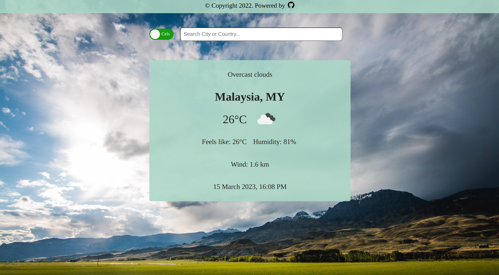

# Weather App

> Live demo [_here_](https://nabelk.github.io/weather-app/).

## Table of Contents

-   [General Info](#general-information)
-   [Built With](#built-with)
-   [Features](#features)
-   [Screenshots](#screenshots)
-   [Contact](#contact)

## General Information

-   The project is a part of The Odin Project: Full Stack JavaScript.
-   This is a weather app that uses the OpenWeather API to fetch the current weather data for a specific location and display it to the user.

## Built With

-   Javascript, HTML & CSS
-   Webpack
-   Babel
-   Date-fns
-   Prettier && eslint
-   Toggle-switchy library

## Features

-   Get the current weather data for a specific location from the OpenWeather API
-   Display the current temperature, weather description, humidity, wind speed and date/time to the user
-   Allow the user to search for a specific location by city or country name
-   Display a loading component while fetching data from the OpenWeather API
-   Allow the user to switch between Fahrenheit and Celsius temperature units

## Screenshots

## Contact

Created by [@nabelk](https://www.linkedin.com/in/nabil-khalid-36791a241/) - feel free to contact me!
